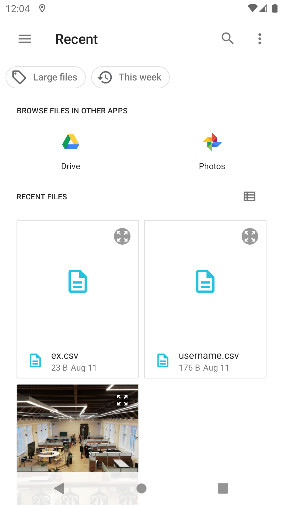

# Globant React Native example app

## Description

Create a web app using react that allows the user to upload PNG files and CSV files, the app should have 3 routes.

There is no need for a backend, all data can make use of the local storage.

`/home` (where is possible to upload files)

Upload button

`/images` (list of png files)

Gallery

`/sheets` (list of csv files)

On this list it should display the filename, and the total amount column 1 (Total)

When uploading csv the only format acceptable is, using line 1 as header (Total), and the rest as data, on the very first column. I.e.

```csv
Total 
100 
20 
```

## Requirements

- React 18
- React Native 0.69.3
- Node.js 18.1.0

## Installation

```bash
yarn
```

## Usage

```bash
yarn android
```

or

```bash
yarn ios
```

## Testing

```bash
yarn test
```

Coverage:

```bash
yarn test:coverage
```

## Screen shots





